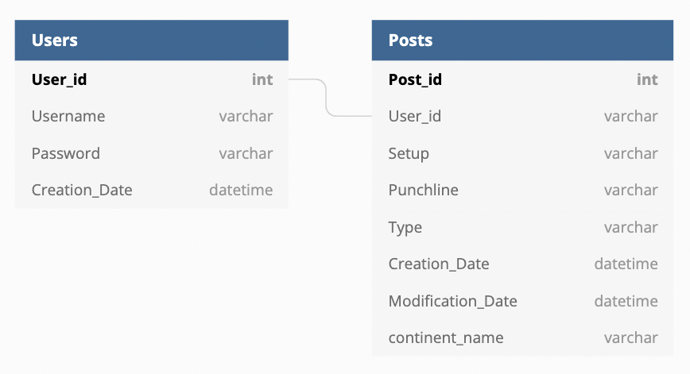
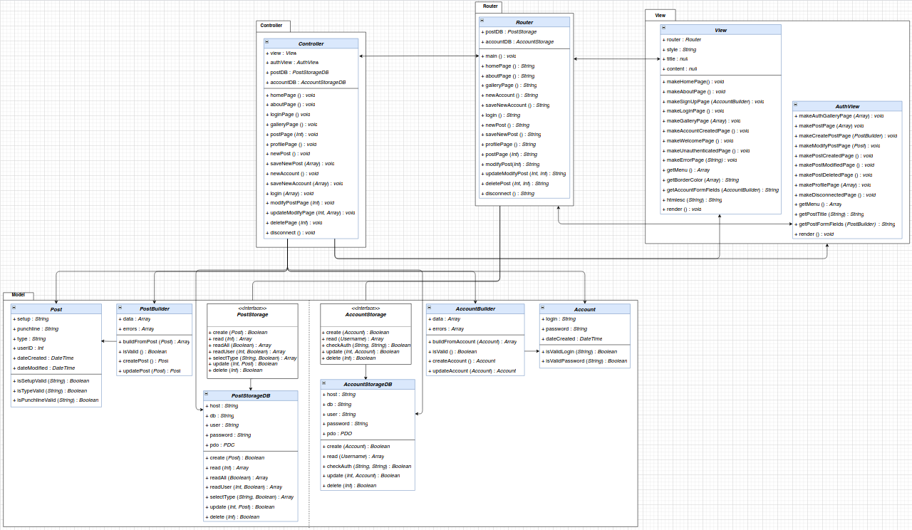

## Project idea 
A platform where users can share short stories or jokes.
The title of each post is the setup for the story or the joke, and the detailed page reveals the punch line.

This project was developed as a school project for the TechnoWeb3 course in Unicaen.

## Contributors
 - Dhia MERZOUGUI
 - Julien MERCIER

## Technologies Used
- PHP
- MYSQL

## Architecture
#### Database Architecture

#### Database Architecture

## Trello Page
[Trello Page](https://trello.com/b/rdhJbPOL)
